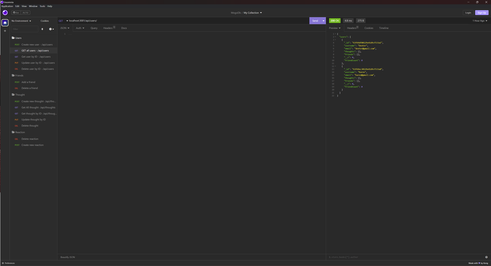
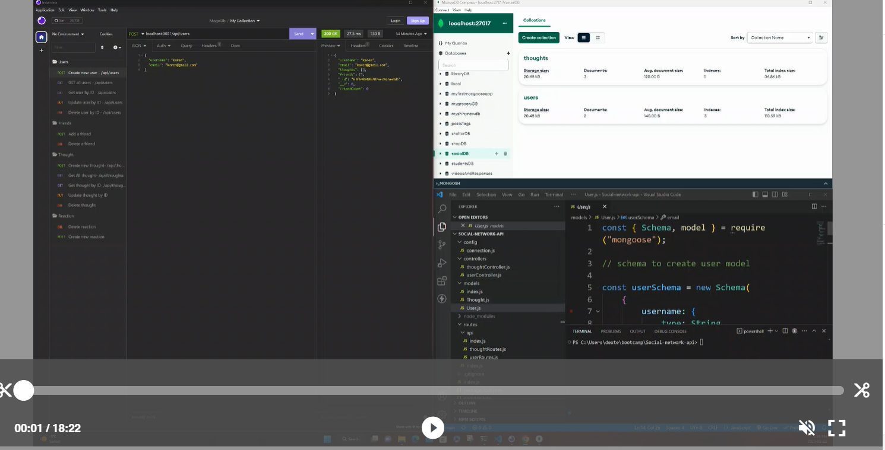

# Social-Network-API

## Description

Social network api showcases use of MongoDB, Mongoose and Express to build a fully scalable API for a social media site. MongoDB allows our site to handle large amounts of unstructed data having the flexibility for future grouth needs.
users can share their thoughts, react to friends’ thoughts, and create a friend list.

API Routes
<code>/api/users</code>

-   <code>GET</code> all users
-   <code>GET</code> a single user by its <code>\_id</code> and populated thought and friend data
-   <code>POST</code> a new user:

<code>
  // example data
{
  "username": "lernantino",
  "email": "lernantino@gmail.com"
}
</code>

-   <code>PUT</code> to update a user by its <code>\_id</code>
-   <code>DELETE</code> to remove user by its <code>\_id</code>

<code>/api/users/:userId/friends/:friendId</code>

-   <code>POST</code> to add a new friend to a user's friend list
-   <code>DELETE</code> to remove a friend from a user's friend list

<code>/api/thoughts</code>

-   <code>GET</code> to get all thoughts
-   <code>GET</code> to get a single thought by its <code>\_id</code>
-   <code>POST</code> to create a new thought (don't forget to push the created thought's \_id to the associated user's thoughts array field)

<code>// example data
{
"thoughtText": "Here's a cool thought...",
"username": "lernantino",
"userId": "5edff358a0fcb779aa7b118b"
}</code>

-   <code>PUT</code> to update a thought by its <code>\_id</code>
-   <code>DELETE</code> to remove a thought by its <code>\_id</code>

<code>/api/thoughts/:thoughtId/reactions</code>

-   <code>POST</code> to create a reaction stored in a single thought's <code>reactions</code> array field
-   <code>DELETE</code> to pull and remove a reaction by the reaction's <code>reactionId</code> value

## Screenshots

# Videos

[Dexter's Github repository- Social network api](https://github.com/civ187/social-network-API)
